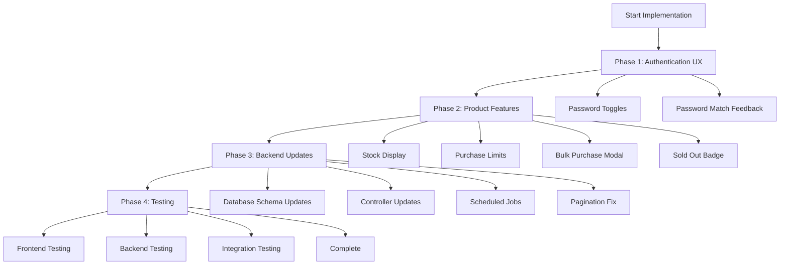

# E-Store Bug Fixes & Feature Enhancements - Implementation Plan

## Overview
This document outlines the comprehensive plan to implement 10 key fixes and features across the E-store application, covering authentication UX, product management, stock handling, payment flow consistency, cart state management, admin capabilities, order lifecycle, pagination, and user profile enhancements.

---

## 1. Password Visibility & Match Feedback 🔐

### Affected Files
- [`E-store/frontend/src/screens/LoginScreen.js`](E-store/frontend/src/screens/LoginScreen.js)
- [`E-store/frontend/src/screens/RegisterScreen.js`](E-store/frontend/src/screens/RegisterScreen.js)
- [`E-store/frontend/src/screens/ProfileScreen.js`](E-store/frontend/src/screens/ProfileScreen.js)

### Implementation Details

#### LoginScreen
- Add `showPassword` state (boolean)
- Wrap password input in relative positioned div
- Add eye icon button (FontAwesome `fa-eye` / `fa-eye-slash`) positioned absolute
- Toggle input type between 'password' and 'text'

#### RegisterScreen
- Add `showPassword` and `showConfirmPassword` state
- Add `passwordsMatch` state for real-time validation
- Add `useEffect` hook to check if `password === confirmPassword` when either changes
- Display feedback text below confirmPassword field:
  - Green text: "Passwords match ✓" when matching and both fields have content
  - Red text: "Passwords do not match" when not matching and confirmPassword has content
- Eye icons for both password fields

#### ProfileScreen
- Same implementation as RegisterScreen for password change fields

### Technical Notes
- Use inline styling to position eye icon absolutely within input container
- Icon should be clickable with `cursor: pointer`
- Color scheme: use existing CSS variables (`--text-primary`, `--accent-success`, `--accent-danger`)

---

## 2. Product Carousel Sorting by Reviews 📊

### Affected Files
- [`E-store/backend/controllers/productController.js`](E-store/backend/controllers/productController.js:155)
- [`E-store/backend/models/productModel.js`](E-store/backend/models/productModel.js)

### Current State
```javascript
// Line 156 in productController.js
const products = await Product.find({}).sort({ rating: -1 }).limit(3)
```

### Changes Required
- Update `getTopProducts()` to sort by `numReviews` instead of `rating`
- Verify `numReviews` has default value of 0 in Product schema (already confirmed)

```javascript
const products = await Product.find({}).sort({ numReviews: -1 }).limit(3)
```

---

## 3. Stock Display & Purchase Limits 📦

### Affected Files
- [`E-store/frontend/src/screens/ProductScreen.js`](E-store/frontend/src/screens/ProductScreen.js)
- [`E-store/frontend/src/components/Product.js`](E-store/frontend/src/components/Product.js)

### ProductScreen Changes

#### Stock Count Display
Add below "In Stock" / "Out Of Stock" indicator:
```jsx
{product.countInStock > 0 && (
  <p style={{ color: 'var(--text-secondary)' }}>
    {product.countInStock} units in stock
  </p>
)}
```

#### Purchase Limit (Max 5)
Current code (line ~170):
```javascript
[...Array(product.countInStock).keys()].map((x) => (
  <option key={x + 1} value={x + 1}>{x + 1}</option>
))
```

Change to:
```javascript
[...Array(Math.min(5, product.countInStock)).keys()].map((x) => (
  <option key={x + 1} value={x + 1}>{x + 1}</option>
))
```

#### Bulk Purchase Feature
- Add "Bulk Order" button next to "Add to Cart"
- Create modal component with:
  - Input field: "How many units do you need?"
  - Text: "For bulk orders, please contact us for better pricing"
  - Button: "Contact Seller" (opens email client or shows contact info)
  - Close button

### Product Component - Sold Out Badge
Add conditional badge overlay when `product.countInStock === 0`:
```jsx
{product.countInStock === 0 && (
  <div style={{
    position: 'absolute',
    top: 0,
    right: 0,
    background: 'var(--accent-danger)',
    color: 'white',
    padding: '0.5rem 1rem',
    borderRadius: '0 0 0 8px',
    fontWeight: 'bold'
  }}>
    SOLD OUT
  </div>
)}
```

### Prevent Opening Sold Out Products
In [`Product.js`](E-store/frontend/src/components/Product.js), disable link when out of stock:
```jsx
{product.countInStock === 0 ? (
  <div style={{ cursor: 'not-allowed', opacity: 0.6 }}>
    {/* Product card content */}
  </div>
) : (
  <Link to={`/product/${product._id}`}>
    {/* Product card content */}
  </Link>
)}
```

---

## 4. Payment Method Consistency 💳

### Affected Files
- [`E-store/frontend/src/screens/PaymentScreen.js`](E-store/frontend/src/screens/PaymentScreen.js)
- [`E-store/frontend/src/screens/PlaceOrderScreen.js`](E-store/frontend/src/screens/PlaceOrderScreen.js)
- [`E-store/frontend/src/screens/OrderScreen.js`](E-store/frontend/src/screens/OrderScreen.js)

### Standard Labels
- **Option 1**: "PayPal or Credit Card"
- **Option 2**: "Cash on Delivery"

### Audit Points
1. PaymentScreen radio button labels (already correct)
2. PlaceOrderScreen payment method display
3. OrderScreen payment method display
4. Any other screens showing payment info

### Fix Strategy
Ensure all displays use exact saved value from Redux/database without modification.

---

## 5. Cart State Persistence 🛒

### Affected Files
- [`E-store/frontend/src/reducers/cartReducers.js`](E-store/frontend/src/reducers/cartReducers.js)
- [`E-store/frontend/src/store.js`](E-store/frontend/src/store.js)
- [`E-store/frontend/src/screens/ShippingScreen.js`](E-store/frontend/src/screens/ShippingScreen.js)

### Issue Analysis
Cart becomes empty when navigating back from ShippingScreen.

### Root Cause Investigation
1. Check if `CART_RESET` action is being triggered inappropriately
2. Verify localStorage sync in cart actions
3. Ensure store initialization reads from localStorage correctly

### Solution
- Add `useEffect` in ShippingScreen to verify cart items on mount
- Ensure navigation doesn't trigger cart reset
- Add defensive check: if cart is empty but localStorage has items, restore them

---

## 6. Per-Product Shipping Cost 🚚

### Affected Files
- [`E-store/backend/models/productModel.js`](E-store/backend/models/productModel.js)
- [`E-store/frontend/src/screens/ProductEditScreen.js`](E-store/frontend/src/screens/ProductEditScreen.js)
- [`E-store/backend/controllers/productController.js`](E-store/backend/controllers/productController.js)
- [`E-store/frontend/src/actions/cartActions.js`](E-store/frontend/src/actions/cartActions.js)
- [`E-store/frontend/src/screens/CartScreen.js`](E-store/frontend/src/screens/CartScreen.js)
- [`E-store/frontend/src/screens/PlaceOrderScreen.js`](E-store/frontend/src/screens/PlaceOrderScreen.js)

### Database Schema Update
Add to Product model:
```javascript
shippingCost: {
  type: Number,
  required: true,
  default: 0
}
```

### Admin Form Update (ProductEditScreen)
Add input field:
```jsx
<div style={{ marginBottom: '1.5rem' }}>
  <label>Shipping Cost</label>
  <input
    type='number'
    placeholder='Enter shipping cost'
    value={shippingCost}
    onChange={(e) => setShippingCost(e.target.value)}
  />
</div>
```

### Backend Controller Updates
- `createProduct()`: Include `shippingCost: 0` in new product creation
- `updateProduct()`: Handle shippingCost in req.body and update

### Cart Calculation Logic
Update cart reducer to store shippingCost with each item:
```javascript
dispatch({
  type: CART_ADD_ITEM,
  payload: {
    ...existingFields,
    shippingCost: data.shippingCost
  }
})
```

### Order Total Calculation
In PlaceOrderScreen, calculate shipping as:
```javascript
const shippingPrice = cart.cartItems.reduce(
  (acc, item) => acc + (item.shippingCost * item.qty), 
  0
)
```

---

## 7. Auto-Delete Unpaid Orders ⏰

### New Files to Create
- `E-store/backend/jobs/orderCleanup.js`
- `E-store/backend/utils/emailService.js` (if not exists)

### Implementation Strategy

#### Scheduled Job (Node-Cron)
Install: `npm install node-cron`

Create `orderCleanup.js`:
```javascript
import cron from 'node-cron'
import Order from '../models/orderModel.js'
import { sendAdminNotification } from '../utils/emailService.js'

// Run daily at 2 AM
cron.schedule('0 2 * * *', async () => {
  const thirtyDaysAgo = new Date(Date.now() - 30 * 24 * 60 * 60 * 1000)
  
  const ordersToDelete = await Order.find({
    isPaid: false,
    paymentMethod: { $in: ['PayPal or Credit Card'] },
    createdAt: { $lt: thirtyDaysAgo }
  })
  
  if (ordersToDelete.length > 0) {
    await Order.deleteMany({ 
      _id: { $in: ordersToDelete.map(o => o._id) } 
    })
    
    // Notify admins
    await sendAdminNotification({
      subject: 'Unpaid Orders Auto-Deleted',
      message: `${ordersToDelete.length} unpaid orders were automatically deleted.`,
      orderIds: ordersToDelete.map(o => o._id)
    })
  }
})
```

Import in `server.js`:
```javascript
import './jobs/orderCleanup.js'
```

#### Admin Notification
- Send email to admin users
- Log to admin dashboard (if exists)
- Include order IDs and count

---

## 8. Pagination - 8 Products Per Page 📄

### Affected Files
- [`E-store/backend/controllers/productController.js`](E-store/backend/controllers/productController.js:9)

### Current Code
```javascript
const pageSize = 10  // Line 9
```

### Change Required
```javascript
const pageSize = 8
```

### Verification
- Check [`Paginate.js`](E-store/frontend/src/components/Paginate.js) - no changes needed (it's dynamic)
- Test with various product counts to ensure correct page calculations

---

## 9. Profile Orders - Show Product Images 🖼️

### Affected Files
- [`E-store/backend/controllers/orderController.js`](E-store/backend/controllers/orderController.js:95)
- [`E-store/frontend/src/screens/ProfileScreen.js`](E-store/frontend/src/screens/ProfileScreen.js:283)

### Backend Changes
Update `getMyOrders()` to populate product details:
```javascript
const orders = await Order.find({ user: req.user._id })
  .populate({
    path: 'orderItems.product',
    select: 'name image'
  })
```

**Note**: This requires orderItems to store product references, not just product data. May need to restructure how orders store product information.

### Alternative Approach (Simpler)
Since orderItems already stores product data (name, image) at order creation time, just display it directly:

Update ProfileScreen table to add product column:
```jsx
<thead>
  <tr>
    <th>PRODUCTS</th>
    <th>ID</th>
    <th>DATE</th>
    <th>TOTAL</th>
    <th>PAID</th>
    <th>DELIVERED</th>
    <th></th>
  </tr>
</thead>
<tbody>
  {orders.map(order => (
    <tr key={order._id}>
      <td>
        <div style={{ display: 'flex', gap: '0.5rem', flexWrap: 'wrap' }}>
          {order.orderItems.slice(0, 3).map((item, idx) => (
            <div key={idx} title={item.name}>
              
            </div>
          ))}
          {order.orderItems.length > 3 && (
            <span style={{ alignSelf: 'center' }}>
              +{order.orderItems.length - 3} more
            </span>
          )}
        </div>
      </td>
      {/* rest of columns */}
    </tr>
  ))}
</tbody>
```

---

## Implementation Flow Diagram



---

## Testing Checklist

### Authentication
- [ ] Login screen password toggle works
- [ ] Register screen password toggles work
- [ ] Real-time password match feedback (green/red)
- [ ] Profile screen password change toggles work

### Product Features
- [ ] Carousel shows products sorted by review count
- [ ] Stock count displays correctly
- [ ] Quantity selector caps at 5
- [ ] Bulk purchase modal opens and functions
- [ ] Sold out badge appears on out-of-stock products
- [ ] Cannot click into sold out products

### Payment & Cart
- [ ] Payment method labels consistent across all screens
- [ ] Cart persists when navigating back from shipping
- [ ] Per-product shipping costs calculate correctly

### Admin & Backend
- [ ] Admin can set shipping cost per product
- [ ] Scheduled job runs and deletes old unpaid orders
- [ ] Admin receives notification of deletions

### Pagination & Profile
- [ ] 8 products display per page
- [ ] Page numbers calculate correctly
- [ ] Profile shows product images in order history

---

## Estimated Timeline

| Phase | Tasks | Estimated Time |
|-------|-------|----------------|
| Phase 1: Authentication UX | Password toggles & feedback | 2-3 hours |
| Phase 2: Product Features | Stock, limits, bulk, sold out | 4-5 hours |
| Phase 3: Payment & Cart | Consistency, persistence, shipping | 3-4 hours |
| Phase 4: Backend Updates | Schema, controllers, jobs | 3-4 hours |
| Phase 5: Pagination & Profile | 8 per page, order images | 2 hours |
| Phase 6: Testing & Bug Fixes | Comprehensive testing | 3-4 hours |
| **Total** | | **17-22 hours** |

---

## Risk Considerations

1. **Cart State Persistence**: May require debugging session to identify exact cause
2. **Order Cleanup Job**: Ensure cron job starts properly on server deployment
3. **Product Shipping Costs**: May need database migration script for existing products
4. **Sold Out Products**: Need to handle edge cases where user has product in cart when it goes out of stock

---

## Dependencies

### NPM Packages to Install
```bash
cd E-store/backend
npm install node-cron
```

### Optional
- Email service library if not already implemented (nodemailer, sendgrid, etc.)

---

## Notes

- All file paths are relative to `E-store/` directory
- Maintain existing code style and CSS variable usage
- Test on both development and production environments
- Consider creating database backup before schema changes
- Document any API changes for frontend team